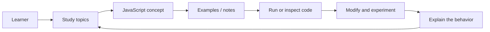
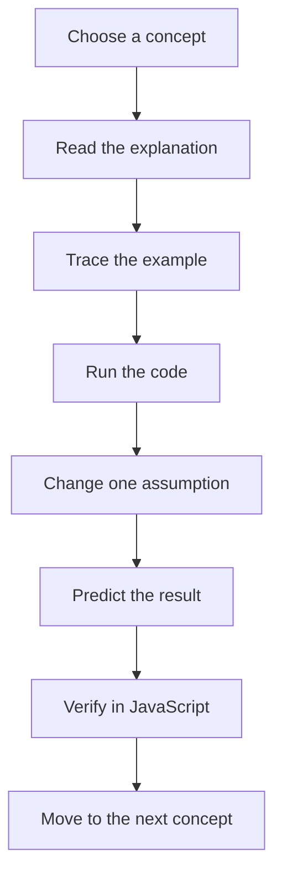
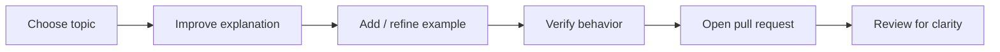

<div align="center">

# 33 JavaScript Concepts

**A practical JavaScript learning repository for studying core language concepts through notes, examples, and hands-on exploration.**


[Browse study material](./study) · [Issues](https://github.com/Nischhalsubba/33-js-concepts/issues)

</div>

## Overview

**33 JavaScript Concepts** is a study-oriented repository for learning, reviewing, and experimenting with important JavaScript ideas. It is useful as a reference for learners, developers refreshing fundamentals, and educators organizing examples around individual concepts.

| Audience | Use this repository for |
|---|---|
| Developers | Refresh language fundamentals and inspect examples |
| Learners | Move from concept → example → experiment → understanding |
| Educators | Use focused topics as teaching or discussion material |
| Reviewers | See how the learning material is organized and maintained |

<details open>
<summary><strong>🧭 Interactive learning architecture</strong></summary>



</details>

## Learning flow



## Repository map

- [`study/`](./study) — learning material and concept-focused content.
- [`.github/`](./.github) — repository automation and GitHub configuration.

## Getting started

```bash
git clone https://github.com/Nischhalsubba/33-js-concepts.git
cd 33-js-concepts
```

Open the relevant material under `study/`. When an example is browser-based, use a browser or local static server. When it is plain JavaScript, use the runtime appropriate to that example.

## Documentation & discoverability

This README intentionally uses descriptive terms such as **JavaScript concepts, JavaScript fundamentals, JavaScript learning, JavaScript examples, and JavaScript study notes** so the repository is easier to understand from GitHub search and external search engines without keyword stuffing.

Good additions should include a clear topic heading, a short explanation, a focused example, expected behavior, and links to authoritative references when useful.

## Contribution flow



Keep examples small, explain *why* behavior occurs, and avoid turning concept notes into unnecessary framework demos.